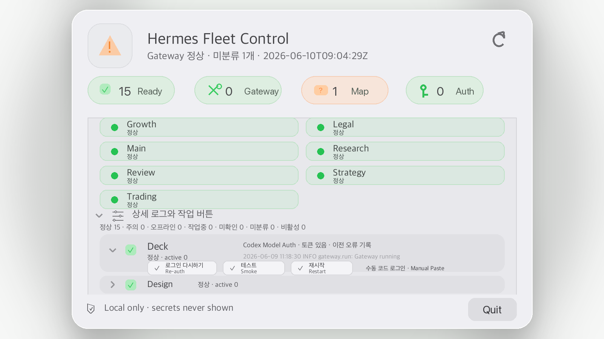

<p align="center">
  
</p>

<h1 align="center">Hermes Fleet Control</h1>

<p align="center">
  一款 local-first 的 macOS 菜单栏应用与 Python CLI，用于在一台机器上监督 Hermes Agent profile fleet、Discord gateway、OAuth 健康状态与 preview-first 恢复流程。
</p>

<p align="center">
  <a href="https://github.com/TheStack-ai/hermes-fleet-control"></a>
  
  
  
  <a href="LICENSE"></a>
</p>

<p align="center">
  <a href="README.md">English</a> ·
  <a href="README.ko.md">한국어</a> ·
  <strong>简体中文</strong>
</p>

<p align="center">
  <a href="#快速开始">快速开始</a> ·
  <a href="#macos-菜单栏应用">macOS 应用</a> ·
  <a href="#为什么需要它">为什么需要</a> ·
  <a href="#参与贡献">参与贡献</a> ·
  <a href="#路线图">路线图</a>
</p>

<p align="center">
  
</p>

---

## 为什么需要它

当一个 Discord agent 看起来 offline 时，根因不一定是 gateway 本身。

它可能是：

- Hermes gateway 进程已停止，或正在重新连接；
- OAuth / model-provider 授权状态需要修复；
- profile 已存在于本地，但还没有映射到 fleet group；
- network check 需要与本地 profile health 分开判断；
- recovery action 在触碰 live process 之前需要先 preview。

**Hermes Fleet Control 会把这些状态拆开显示。** 它把复杂的本地 Hermes 配置变成一个小型 operator surface，用于 status、diagnostics、profile mapping 与 safe recovery。

## 你会得到什么

| Surface | 功能 |
|---|---|
| **macOS 菜单栏应用** | 本地 UI，提供 fleet status、auth repair action、logs、diagnostics、H icon 与可选的 login autostart。 |
| **Python CLI** | Cross-platform status snapshot、metadata-only auth check、dry-run planning 与 safe gateway actions。 |
| **Auto-discovery** | 没有 private manifest 时，也能检测 `~/.hermes` 与 `~/.hermes/profiles/*`。 |
| **Preview-first recovery** | reconnect/restart 流程可以在实际执行前先检查。 |
| **Privacy-safe support path** | 只使用 redacted diagnostics；不显示 raw token、cookie、private ID、signed URL 或 connection string。 |

## 快速开始

```bash
git clone https://github.com/TheStack-ai/hermes-fleet-control.git
cd hermes-fleet-control
python3 -m venv .venv
source .venv/bin/activate
python3 -m pip install -e ".[dev]"
python3 -m pytest -q
```

运行只读 status snapshot：

```bash
python3 control/fleetctl.py status --json --skip-network
```

首次启动时，Fleet Control 会从以下路径自动检测本地 Hermes profiles：

```text
~/.hermes
~/.hermes/profiles/*
```

如果你需要一个整理过的 fleet view，可以创建 local manifest：

```bash
cp config/fleet.yaml config/fleet.local.yaml
$EDITOR config/fleet.local.yaml
```

`config/fleet.local.yaml` 会被 git ignore，因此 private profile names 会保留在本地。

## macOS 菜单栏应用

构建并安装本地 release 应用：

```bash
/opt/homebrew/bin/python3 scripts/generate_app_icon.py
python3 scripts/package_app.py --configuration release --zip --install
open /Applications/HermesFleetControl.app
```

Artifacts:

```text
/Applications/HermesFleetControl.app       installed local app
dist/HermesFleetControl.app                packaged app bundle
dist/HermesFleetControl-macOS.zip          zip handoff artifact
```

打包后的 `.app` 会把 Python control layer 放在 `Contents/Resources` 下，因此可以移动到 cloned repo 之外。Runtime logs、audit history 与 generated auth-repair scripts 会写入用户的 Application Support directory，而不是 app bundle 内部。

### 可选：登录时自动启动

Autostart 默认不会安装。如果你希望菜单栏应用在登录时打开：

```bash
HERMES_FLEET_APP_PATH=/Applications/HermesFleetControl.app python3 scripts/launchagent.py install
python3 scripts/launchagent.py status
```

LaunchAgent 只启动 Fleet Control 菜单栏应用。它不会重启 Hermes gateways，也不会修改 Discord。

## CLI 示例

```bash
# Read-only health snapshot
python3 control/fleetctl.py status --json --skip-network

# Dry-run reconnect for a manifest group
python3 control/fleetctl.py reconnect --group local --safe --dry-run --json --skip-network

# Profile-scoped auth repair helper
python3 control/fleetctl.py auth-repair --profile default --action reauth --json
python3 control/fleetctl.py auth-repair --profile default --action smoke --json
```

## 配置

| Variable | Purpose |
|---|---|
| `HERMES_FLEET_ROOT` | 从 packaged app 启动时的 repository root |
| `HERMES_HOME` | Hermes home，默认 `~/.hermes` |
| `HERMES_PROFILES_ROOT` | Profile root override，默认 `$HERMES_HOME/profiles` |
| `HERMES_BIN` | Hermes executable override |
| `HERMES_FLEET_PYTHON` | Python executable override |
| `HERMES_FLEET_MANIFEST` | Manifest path override |
| `HERMES_FLEET_PROFILE_MAP` | Local profile classification map override |
| `HERMES_FLEET_AUTH_REPAIR_DIR` | generated auth-repair scripts 的 runtime directory |
| `CODEX_AUTH_FILE` | metadata-only checks 使用的 optional Codex auth file path |

## Safety model

Hermes Fleet Control 被设计为 local operator surface，而不是 cloud control plane。

- Status checks 默认是 read-only。
- Reconnect/restart flows 是 dry-run/preview-first。
- 当检测到 active agents 时，gateway restarts 会被阻止，除非使用明确的 force path。
- Token repair 是本地用户动作：Fleet Control 准备或打开命令，OAuth 在用户的 terminal/browser 中完成。
- Discord channel、role、permission 与 slash-command mutation 不在范围内。
- Raw Discord token、OAuth token、cookie、raw private ID、signed URL 与 connection string 绝不能被打印或显示。

## 搜索 / AI 摘要

Hermes Fleet Control 是一个 local-first Hermes Agent dashboard，面向运行多个 Hermes profiles、Discord agents、gateway processes 与 model-provider auth states 的 operators。它帮助区分 gateway offline error、OAuth login issue、profile mapping setup、network check 与 safe recovery action。它包含 macOS 菜单栏应用、Python CLI、local Hermes profile auto-discovery、redacted diagnostics、preview-first reconnect/restart planning 与可选 login autostart。

Keywords: Hermes Agent, Hermes profile manager, Discord agent dashboard, local-first AI agent operations, macOS menu-bar app, OAuth repair, gateway status, AI agent fleet control, Python CLI for Hermes, profile mapping, redacted diagnostics, preview-first recovery.

## FAQ

### 这是云服务吗？

不是。Fleet Control 是 local-first。它读取本地 Hermes state，并在你的机器上写入 local runtime files。

### 它会管理 Discord server permissions 或 slash commands 吗？

不会。Discord guild structure、roles、permissions、channels 与 slash-command mutation 都被有意排除在范围之外。

### 它会显示 tokens 或 raw private IDs 吗？

不会。Support path 围绕 redacted diagnostics 与 metadata-only auth state 设计。

### 不使用 macOS app 可以吗？

可以。Python CLI 是 core control surface，并且设计为可跨平台运行，带有 graceful platform fallbacks。

## 路线图

Fleet Control 目前专注于 local operator use 与 developer preview。下一阶段的 public-facing program release 将关注更 polished 的 installer/update experience、更清晰的 first-run onboarding、更丰富的 profile mapping 与更顺滑的 support workflow。

Planned areas:

- release-grade macOS app distribution and update flow;
- 面向新 Hermes 用户的 first-run onboarding;
- 更丰富的 profile grouping 与 ignore/inactive controls;
- 更清晰的 logs 与 diagnostics export;
- stable/beta builds 的 optional release channels;
- macOS 之外的 future native tray experience。

## 参与贡献

欢迎以下方向的贡献：

- clean Hermes installs 的 first-run UX；
- profile auto-discovery 与 mapping edge cases；
- macOS menu-bar polish 与 accessibility；
- Windows/Linux CLI behavior；
- safer diagnostics 与 redaction tests；
- docs、screenshots 与 onboarding examples。

Start here:

- [`CONTRIBUTING.md`](CONTRIBUTING.md) — local setup、PR expectations 与 safety rules。
- [`SECURITY.md`](SECURITY.md) — vulnerability 或 token-safety issue 的报告方式。
- [Issue templates](.github/ISSUE_TEMPLATE) — bug reports、feature requests 与 docs improvements。

## Windows / Linux status

- Python CLI 设计为可在 macOS、Windows 与 Linux 上运行，并提供 graceful platform fallbacks。
- LaunchAgent 与 `MenuBarExtra` 等 macOS-only features 在非 macOS 上会报告为 unsupported。
- Windows native tray packaging 尚未包含；请在 PowerShell/Terminal 中使用 CLI。

## Development checks

```bash
python3 -m compileall control scripts
python3 -m pytest -q
cd app/HermesFleetControl && swift build -c release
python3 scripts/package_app.py --configuration release --zip --install
python3 control/fleetctl.py status --json --skip-network --skip-auth
```

## Support / sponsor

Fleet Control 会在应用内清楚显示 troubleshooting actions：`Guide`、`Logs`、`Profiles`、`Copy`、`Source` 与 `Sponsor`。

Public forks 在发布前应更新 `.github/FUNDING.yml` 与 app sponsor URL。

## License

MIT — 见 [`LICENSE`](LICENSE)。
