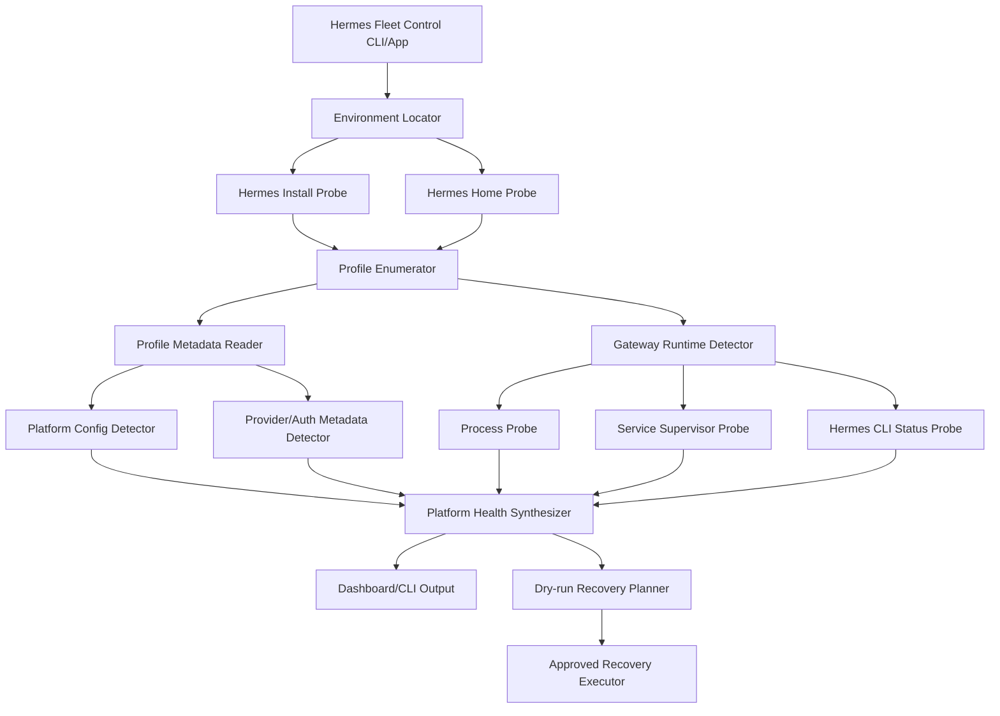

# PRD — Hermes Fleet Control

_Status: Draft v0.1_
_Last updated: 2026-06-09 16:14 KST_
_Owner: Hermes Fleet Control contributors_

## 0. Executive Summary

**Hermes Fleet Control** is a local-first control plane for people who run one or more **Hermes Agent** profiles connected to messaging platforms such as **Slack, Telegram, and Discord**.

The product does **not** replace Hermes Agent and does **not** ask users to reconnect Slack/Telegram/Discord tokens into a new cloud service. Instead, it attaches to the user's existing Hermes installation, discovers profiles and gateways, reads only safe metadata, and presents a normalized health/recovery surface:

```text
Hermes install -> profiles -> gateway service -> platform adapters -> provider/auth -> sessions/cron/watchdog
```

The key product challenge is environment diversity:

- users may run Hermes on macOS, Linux, WSL, Docker, SSH servers, or laptops that sleep;
- users may use the default profile, named profiles, cloned profiles, or profile command aliases;
- each profile may connect to Discord, Slack, Telegram, or several platforms at once;
- each platform has different failure modes: Discord privileged intents, Slack Socket Mode and scopes, Telegram privacy mode and allowed users/chats;
- provider/auth failures can look like platform offline failures;
- process supervisors differ: launchd, systemd, nohup/foreground, tmux, Docker, or none.

Therefore the core design principle is:

> **Attach to Hermes locally through a layered discovery and probe model, not by owning users' messaging credentials.**

## 1. Problem Statement

Hermes users who connect agents to Slack, Telegram, Discord, or multiple platforms often cannot quickly answer:

1. Which Hermes profiles exist on this machine?
2. Which profile is connected to which platform?
3. Is the gateway process running?
4. Is the platform adapter connected or silently misconfigured?
5. Is the issue actually model/provider auth instead of Slack/Telegram/Discord?
6. Are cron jobs/watchdogs running?
7. Can I safely restart this one agent without interrupting active work?
8. If every user's environment differs, how can an OSS tool reliably attach without destructive setup assumptions?

Hermes itself exposes many capabilities, but day-2 operations across profiles and messaging platforms need a dedicated fleet view and a safe recovery workflow.

## 2. Product Goal

Create a local-first OSS management program that can:

- discover existing Hermes installations and profiles;
- detect Slack/Telegram/Discord configuration and runtime health per profile;
- separate `gateway health`, `platform adapter health`, and `provider/model auth health`;
- provide safe, targeted recovery actions with dry-run and active-agent gates;
- work across heterogeneous user environments through explicit adapters and fallback probes;
- never print or upload raw secrets, tokens, cookies, private IDs, or connection strings.

## 3. Non-Goals

v0.x explicitly does **not** attempt to:

- become a full Hermes GUI replacement;
- host a cloud control panel that receives user tokens;
- mutate Slack/Discord/Telegram apps automatically by default;
- create new bots for users before the existing-Hermes discovery path works;
- guarantee platform-side permissions that cannot be verified locally;
- restart all gateways globally by default;
- inspect or expose chat content/session transcripts except aggregate active/busy metadata;
- manage non-Hermes bots.

## 4. Source-of-Truth Evidence

This PRD is based on:

1. This repository's local planning context.
2. Current metadata-only runtime helper: `scripts/runtime_status.py`.
3. Hermes docs:
   - Messaging Gateway: <https://hermes-agent.nousresearch.com/docs/user-guide/messaging/>
   - Profiles: <https://hermes-agent.nousresearch.com/docs/user-guide/profiles>
   - CLI Commands: <https://hermes-agent.nousresearch.com/docs/reference/cli-commands>
   - Providers: <https://hermes-agent.nousresearch.com/docs/integrations/providers>
   - Slack: <https://hermes-agent.nousresearch.com/docs/user-guide/messaging/slack>
   - Telegram: <https://hermes-agent.nousresearch.com/docs/user-guide/messaging/telegram>
   - Discord: <https://hermes-agent.nousresearch.com/docs/user-guide/messaging/discord>
4. Hermes CLI help observed locally:
   - `hermes gateway` supports `run/start/stop/restart/status/install/uninstall/list/setup`.
   - `hermes profile` supports `list/use/create/delete/show/alias/export/import/info`.
   - `hermes status` supports `--all` and `--deep`.

## 5. Users and Personas

### 5.1 Solo Power User

Runs Hermes on a laptop or home server, has one or more agents connected to Telegram/Discord/Slack.

Jobs:

- know if agents are online;
- recover after laptop sleep or provider token failure;
- avoid losing in-flight work.

### 5.2 Multi-Profile AI Org Operator

Runs many profile-specific agents, often one bot per role/team/channel.

Jobs:

- see per-profile status at a glance;
- diagnose which agents are degraded;
- recover one profile, not the whole fleet;
- maintain auditability.

### 5.3 Team Admin / Slack or Discord Operator

Runs Hermes for a team workspace/server.

Jobs:

- confirm channel/DM behavior;
- detect missing Slack events/scopes or Discord intents;
- produce actionable setup guidance without exposing tokens.

### 5.4 Remote Host Operator

Runs Hermes on a VPS, Docker host, WSL machine, or remote Mac/Linux box.

Jobs:

- attach local desktop/CLI to remote Hermes;
- collect status without exposing secrets;
- perform recovery only after dry-run.

## 6. Core Product Thesis

The product should treat “connecting Slack/Telegram/Discord Hermes agents” as a **Hermes attachment problem**, not a **platform credential ingestion problem**.

### Wrong Model

```text
User gives Fleet Control all Slack/Telegram/Discord tokens
-> Fleet Control talks directly to platforms
-> Fleet Control becomes a second source of truth and secret risk
```

### Right Model

```text
User already configured Hermes
-> Fleet Control discovers Hermes homes/profiles
-> Fleet Control reads config/env key presence, service state, process state, redacted status/log metadata
-> Fleet Control maps platform adapters to profiles
-> Fleet Control reports normalized health and suggests safe actions
```

This makes the tool robust across user environments because Hermes remains the source of truth for actual messaging setup.

## 7. Environment Variability Matrix

| Axis | Variants | Product Requirement |
|---|---|---|
| OS | macOS, Linux, WSL, Docker, Termux-ish, remote SSH | OS adapter abstraction; no hardcoded launchd-only logic |
| Hermes home | `~/.hermes`, `$HERMES_HOME`, profile-local homes, custom env | home locator with ordered probes and manual override |
| Profiles | default only, named profiles, aliases, cloned profiles | profile enumerator must support CLI and filesystem fallback |
| Runtime | gateway service, foreground `gateway run`, tmux, Docker, cron-only | runtime detector must combine CLI status + process + supervisor probes |
| Supervisor | launchd, systemd user, systemd system, none | service adapter interface; unsupported supervisor reported as `unknown`, not `offline` |
| Platform | Slack, Telegram, Discord, multi-platform per profile | platform adapter registry and per-platform health model |
| Provider | API key, OAuth, local endpoint, custom endpoint, provider fallback | provider checks must be metadata-only and separate from platform health |
| Permissions | Slack scopes/events, Telegram privacy/allowed users, Discord intents/mentions | local checks + platform-specific remediation hints + optional approved live validation |
| Privacy | personal DMs, team channels, private groups | redact private IDs by default; show labels only when safe/available |

## 8. Product Principles

1. **Local-first** — default operation stays on the user's machine.
2. **Secret-safe** — never print raw token/key/cookie/connection-string values.
3. **Hermes-native** — use Hermes profile/gateway/status concepts instead of inventing a parallel agent registry.
4. **Progressive discovery** — start with no-risk local metadata, then offer optional deeper probes.
5. **Degraded is not always offline** — distinguish missing config, stopped gateway, connected platform, provider auth failure, and delivery failure.
6. **Dry-run before action** — recovery must explain exactly what would happen first.
7. **Active-work protection** — don't restart profiles with active running agents unless explicitly forced.
8. **Targeted recovery** — repair the smallest affected profile/platform, never the entire fleet by default.
9. **Unknown is a first-class status** — if something cannot be verified locally, show `unknown` with a next check, not fake confidence.
10. **Public OSS safe by design** — private/internal names and local runtime snapshots must not be part of public artifacts.

## 9. Key Product Question: How Do We Connect Existing Hermes Agents Across Different User Environments?

### 9.1 Answer in One Sentence

We connect by installing a **local Fleet Control sidecar/CLI** that discovers Hermes homes and profiles, then attaches to each profile through Hermes CLI/status/process/service/log probes, with optional platform-specific live validation only after explicit user approval.

### 9.2 Four Connection Modes

#### Mode A — Auto Local Discovery

Default for most users.

Probe order:

1. Find `hermes` executable on `PATH`.
2. Run `hermes --version`.
3. Ask Hermes for profile information:
   - `hermes profile list`
   - `hermes profile show <name>` when available
   - `hermes gateway list` when available
4. Resolve homes:
   - `$HERMES_HOME` if set
   - `~/.hermes`
   - `~/.hermes/profiles/<profile>`
5. Read metadata-only files:
   - `config.yaml`
   - `.env` key names/presence only
   - gateway logs redacted and pattern-scanned only
6. Detect runtime:
   - `hermes -p <profile> gateway status`
   - process table
   - launchd/systemd if available

Result:

```text
Profile discovered -> platforms configured -> runtime state -> health score
```

#### Mode B — Manual Hermes Home Attachment

For users with non-standard install paths.

CLI:

```bash
hermes-fleet attach --home /path/to/hermes-home
hermes-fleet attach --profile-home /path/to/profile-home --name myagent
```

Desktop wizard:

```text
Can't find Hermes? Choose Hermes Home...
```

Requirements:

- validate directory shape before reading;
- never assume `~/.hermes`;
- store only the chosen path in Fleet Control local config.

#### Mode C — Remote Host Attachment

For VPS, Docker, or another Mac/Linux host.

Preferred architecture:

```text
Remote host: hermes-fleet-agent status --json
Local app: ssh user@host hermes-fleet-agent status --json
```

MVP can use SSH command execution; later versions can support a localhost-only HTTP daemon.

Rules:

- no raw secrets cross the wire;
- remote status JSON must already be redacted;
- recovery actions require explicit target host/profile/action confirmation.

#### Mode D — Export/Import Snapshot

For support/debug reports and air-gapped users.

```bash
hermes-fleet dump --redacted > fleet-status.json
hermes-fleet view fleet-status.json
```

This supports GitHub Issues without leaking tokens.

## 10. Layered Discovery Architecture



### 10.1 Probe Levels

| Level | Name | Reads | Side Effects | Default? |
|---|---|---|---:|
| L0 | Static shape | filesystem paths, file existence | none | yes |
| L1 | Metadata config | config keys, env key names/presence | none | yes |
| L2 | Runtime local | process table, service manager, `hermes status` | none | yes |
| L3 | Redacted logs | recent gateway log patterns only | none | yes, capped |
| L4 | Platform live validation | Slack/Telegram/Discord API calls using existing tokens | network request | no, approval required |
| L5 | Recovery | start/restart service, clear stuck state | process mutation | no, approval required |

## 11. Data Model

### 11.1 `HermesInstall`

```yaml
HermesInstall:
  id: string
  binary_path: string | null
  version: string | null
  default_home: path | null
  detected_by: enum[path, hermes_cli, env, manual]
  os: enum[macos, linux, wsl, docker, unknown]
  service_managers: [launchd|systemd_user|systemd_system|none|unknown]
  confidence: low|medium|high
```

### 11.2 `HermesProfile`

```yaml
HermesProfile:
  name: string
  home: path
  alias_path: string | null
  config_path: path | null
  env_path: path | null
  has_config: bool
  has_env: bool
  platforms: [PlatformConnection]
  provider_auth: [ProviderAuthSignal]
  gateway_runtime: GatewayRuntime
  cron_summary: CronSummary | null
  safety: ProfileSafetyState
```

### 11.3 `PlatformConnection`

```yaml
PlatformConnection:
  profile: string
  platform: enum[discord, telegram, slack]
  configured: bool
  config_sources: [config_yaml|env|runtime_log|manual]
  required_secret_keys_present: map[string,bool]
  optional_secret_keys_present: map[string,bool]
  safe_labels:
    workspace_name: string | null
    bot_name: string | null
    home_channel_name: string | null
  private_ids:
    present: bool
    redaction: enum[hidden, hashed, shown_by_user_request]
  local_health: HealthStatus
  runtime_health: HealthStatus
  live_validation: LiveValidationStatus
  remediation_hints: [string]
```

### 11.4 `GatewayRuntime`

```yaml
GatewayRuntime:
  state: enum[running, stopped, crash_loop, installed_not_loaded, foreground, unknown]
  pid: int | null
  started_at: datetime | null
  supervisor: enum[launchd, systemd_user, systemd_system, manual, docker, unknown]
  cli_status_raw_redacted: object | null
  last_connected_at: datetime | null
  last_error_summary: string | null
```

### 11.5 `HealthStatus`

```yaml
HealthStatus:
  status: enum[healthy, degraded, offline, missing, unknown, blocked]
  severity: enum[none, info, warning, critical]
  confidence: low|medium|high
  signals: [HealthSignal]
  next_check: string | null
```

### 11.6 `RecoveryPlan`

```yaml
RecoveryPlan:
  profile: string
  platform: discord|telegram|slack|all|null
  proposed_actions:
    - action: enum[start_gateway, restart_gateway, reinstall_service, refresh_status, open_setup_hint]
      reason: string
      risk: low|medium|high
      requires_approval: bool
  blockers:
    - active_agent_running
    - unknown_supervisor
    - provider_auth_missing
    - platform_permission_unverified
  dry_run_text: string
  executable: bool
```

## 12. Platform-Specific Connection Design

### 12.1 Discord

Hermes docs say Discord behavior depends on bot setup, privileged intents, mention/free-response rules, sessions, threads, and allowed users/channels.

#### Config Signals

Detect metadata only:

- `DISCORD_BOT_TOKEN` present?
- `DISCORD_ALLOWED_USERS` present?
- `DISCORD_ALLOWED_CHANNELS` present?
- `DISCORD_FREE_RESPONSE_CHANNELS` present?
- `DISCORD_REQUIRE_MENTION` present/configured?
- `DISCORD_COMMAND_SYNC_POLICY` present?
- `discord.*` section in `config.yaml`?

Do not display raw user/channel IDs by default. Display:

```text
allowed_users: present redacted
free_response_channels: 2 configured redacted
slash_sync_policy: off|safe|bulk|unknown
```

#### Runtime Signals

- gateway process exists for profile;
- `hermes -p <profile> gateway status` reports active/connected when available;
- recent log includes `discord connected` / `Connected as` / slash sync errors;
- recent errors include missing intents, 401/403 auth, slash sync rate limits, message-content empty warnings.

#### Common Failure Modes

| Failure | Local Signal | Product Output |
|---|---|---|
| Bot online but no replies | logs show empty content / no message text; Message Content Intent likely off | `degraded: Discord may be missing Message Content Intent` |
| Slash command issues | slash sync errors/rate limits | `degraded: command sync issue; gateway may still be healthy` |
| Server channel silent | require mention/free-response config mismatch | show routing hints |
| Thread/session confusion | sessions per thread/user | show session model hint |
| Gateway running, model fails | provider/auth error in agent logs | classify as provider, not Discord |

#### Optional Live Validation

Only with user approval:

- call Discord `/users/@me` equivalent through existing Hermes/gateway utilities if available;
- verify bot identity without printing token;
- optionally inspect guild/channel visibility if the user explicitly asks.

No automatic Discord role/channel/permission mutation in v0.x.

### 12.2 Telegram

Hermes docs say Telegram requires a BotFather token and allowed users/chats; privacy mode is a common group failure.

#### Config Signals

Detect metadata only:

- `TELEGRAM_BOT_TOKEN` present?
- `TELEGRAM_ALLOWED_USERS` present?
- `TELEGRAM_ALLOWED_CHATS` present?
- `TELEGRAM_GROUP_ALLOWED_CHATS` present?
- `TELEGRAM_HOME_CHANNEL` present?
- `TELEGRAM_CRON_THREAD_ID` present?
- `TELEGRAM_OBSERVE_UNMENTIONED_GROUP_MESSAGES` configured?
- `telegram.*` section in `config.yaml`?

Output:

```text
Telegram: configured
bot_token: present
allowed_users: present redacted
home_channel: present redacted
privacy_mode: unknown locally
```

#### Runtime Signals

- gateway process exists;
- log patterns for Telegram startup/connected;
- polling/webhook errors;
- authorization denials due to missing allowed users/chats;
- group messages ignored due to privacy mode cannot be confirmed locally unless logs show symptoms.

#### Common Failure Modes

| Failure | Local Signal | Product Output |
|---|---|---|
| Bot denies everyone | missing allowed users/chats | `blocked: TELEGRAM_ALLOWED_USERS missing; Hermes default denies users` |
| Bot works in DM not group | privacy mode or group allowlist | `unknown/degraded: check BotFather privacy + allowed chats` |
| Cron replies wrong topic | missing cron thread override | show topic-mode hint |
| Token invalid | optional live validation fails | `offline: Telegram token validation failed` |

#### Optional Live Validation

Only with user approval:

- call Telegram `getMe` using the existing token in-process without printing it;
- return bot username/id redacted or user-approved shown;
- do not send messages unless user explicitly approves a delivery smoke.

### 12.3 Slack

Hermes docs say Slack uses **Socket Mode** and requires a Bot Token plus App-Level Token; channel behavior depends on scopes/events and app installation.

#### Config Signals

Detect metadata only:

- `SLACK_BOT_TOKEN` present?
- `SLACK_APP_TOKEN` present?
- Slack config section present?
- optional signing secret present?
- slash manifest generated path exists? e.g. `slack-manifest.json` metadata only.

Output:

```text
Slack: configured
bot_token: present
app_token: present
socket_mode: assumed if app token present
```

#### Runtime Signals

- gateway process exists;
- log patterns for Slack/Bolt Socket Mode connected;
- missing `message.channels`/`message.groups` symptoms;
- 401/invalid_auth / not_in_channel / missing_scope errors.

#### Common Failure Modes

| Failure | Local Signal | Product Output |
|---|---|---|
| Works in DMs only | logs or config lacks channel event evidence | `degraded: likely missing message.channels/message.groups event subscriptions` |
| Cannot receive DMs | Messages Tab disabled cannot be verified locally | `unknown: check Slack App Home Messages Tab` |
| Socket Mode off | missing `SLACK_APP_TOKEN` or connection errors | `blocked/degraded` |
| Changed scopes not applied | logs missing_scope; app not reinstalled | `degraded: reinstall Slack app after scope/event changes` |

#### Optional Live Validation

Only with user approval:

- call Slack `auth.test` with existing bot token;
- optionally test Socket Mode app token if supported;
- do not post messages unless user approves a delivery smoke.

## 13. Normalized Health Model

A profile's status is synthesized from independent dimensions.

```yaml
ProfileHealth:
  install: healthy|degraded|unknown
  gateway_service: healthy|offline|degraded|unknown
  platform_config:
    discord: healthy|missing|blocked|unknown
    telegram: healthy|missing|blocked|unknown
    slack: healthy|missing|blocked|unknown
  platform_runtime:
    discord: healthy|degraded|offline|unknown
    telegram: healthy|degraded|offline|unknown
    slack: healthy|degraded|offline|unknown
  provider_auth: healthy|degraded|missing|unknown
  active_work: idle|busy|unknown
  overall: healthy|degraded|offline|blocked|unknown
```

### 13.1 Status Semantics

| Status | Meaning |
|---|---|
| `healthy` | Required local signals are present and no recent critical errors found |
| `degraded` | Gateway or platform is running but one dimension has errors or weak signals |
| `offline` | Required runtime process/service is stopped or unreachable |
| `missing` | Platform/profile not configured |
| `blocked` | Known required setup is absent, e.g. Telegram allowed users missing |
| `unknown` | Cannot safely determine with current probes |

### 13.2 Why Unknown Matters

Some platform facts cannot be known from local files:

- Discord privileged intents may be disabled in Developer Portal.
- Slack event subscriptions may be incomplete.
- Telegram privacy mode may be on in BotFather.

Fleet Control should say:

```text
Telegram group behavior: unknown locally. Next check: BotFather privacy mode or approved getUpdates/log probe.
```

Not:

```text
Telegram healthy
```

unless runtime evidence supports it.

## 14. First-Run UX

### 14.1 CLI Flow

```bash
$ hermes-fleet init

1. Locate Hermes executable
   ✓ /Users/me/.local/bin/hermes

2. Locate Hermes homes
   ✓ default: ~/.hermes
   ✓ profiles: 4 found

3. Scan profiles metadata-only
   ✓ personal: Telegram configured, gateway running
   ✓ teambot: Slack configured, gateway stopped
   ✓ discordbot: Discord configured, provider auth degraded

4. Choose management mode
   [x] read-only dashboard
   [ ] enable safe recovery commands
   [ ] install watchdog
```

### 14.2 Desktop/Menu Bar Flow

```text
Hermes Fleet Control
  Overall: 2 healthy · 1 degraded · 1 offline

  Profiles
    personal      Telegram   healthy
    teambot       Slack      offline: gateway stopped
    discordbot    Discord    degraded: provider auth issue

  Actions
    Refresh status
    Run doctor
    Dry-run recovery...
    Settings...
```

### 14.3 Profile Detail Screen

```text
Profile: discordbot
Home: ~/.hermes/profiles/discordbot
Gateway: running, pid 1234, launchd
Discord: configured, runtime connected, slash sync policy off
Provider: OpenAI Codex OAuth present, last refresh error detected
Active work: idle

Recommended action:
  1. Fix provider auth before touching Discord gateway.
  2. Dry-run: hermes-fleet recover --profile discordbot --provider-auth
```

## 15. CLI Requirements

### 15.1 Commands

```bash
hermes-fleet status
hermes-fleet status --json
hermes-fleet profiles
hermes-fleet profile <name>
hermes-fleet platforms
hermes-fleet providers
hermes-fleet doctor
hermes-fleet attach --home <path>
hermes-fleet recover --profile <name> --dry-run
hermes-fleet recover --profile <name> --approve
hermes-fleet dump --redacted
```

### 15.2 Status Output Contract

Default human output:

```text
Hermes Fleet: 4 profiles
healthy: 2 · degraded: 1 · offline: 1 · unknown: 0

PROFILE      PLATFORM(S)       GATEWAY      PROVIDER      ACTION
personal     telegram          healthy      healthy       none
teambot      slack             offline      healthy       start gateway
discordbot   discord           healthy      degraded      fix provider auth
research     none              missing      healthy       setup platform
```

JSON output must be stable and schema-versioned:

```json
{
  "schema_version": "0.1",
  "generated_at": "2026-06-09T16:14:57+09:00",
  "profiles": []
}
```

## 16. Recovery Requirements

### 16.1 Recovery Decision Tree

```text
Is profile known?
  no -> block
Is gateway stopped?
  yes -> propose start
Is gateway running but platform degraded?
  yes -> inspect platform logs and config
Is provider auth degraded?
  yes -> do not restart platform first; propose provider fix
Is active work running?
  yes -> block restart unless --force and explicit confirmation
Does supervisor exist?
  yes -> use supervisor start/restart
  no -> use hermes -p <profile> gateway run guidance, not background magic
```

### 16.2 Dry-Run Example

```text
Dry-run recovery plan for profile teambot:
- Current: Slack configured, gateway service installed but stopped
- Proposed: hermes -p teambot gateway start
- Risk: low
- Blockers: none detected
- Secrets: no secret values read or printed

Run with:
  hermes-fleet recover --profile teambot --approve
```

### 16.3 Forbidden Default Actions

- no force restart by default;
- no `kill -9` by default;
- no deletion of session mappings by default;
- no clearing auth tokens by default;
- no Discord slash command sync mutation by default;
- no Slack app reinstall automation by default;
- no Telegram BotFather mutation automation by default.

## 17. Security and Privacy Requirements

### 17.1 Secret Handling

Fleet Control may detect that a secret key exists, but must not print or persist raw values.

Allowed:

```json
{"SLACK_BOT_TOKEN": "present"}
```

Forbidden:

```json
{"SLACK_BOT_TOKEN": "<raw-token-value>"}
```

### 17.2 Private ID Handling

By default, IDs are hidden or counted.

Allowed:

```text
allowed_channels: 3 configured redacted
```

Optional user-controlled mode:

```bash
hermes-fleet status --show-private-ids
```

Even then, warn before output and avoid GitHub issue dumps.

### 17.3 Logs

Log scanning must:

- cap recent lines by default;
- redact token-like patterns;
- summarize errors;
- never include full message text unless user asks and confirms.

### 17.4 Local Config

Fleet Control stores:

- attached Hermes homes;
- user UI preferences;
- explicit aliases/tags;
- cached redacted status snapshots.

Fleet Control does not store:

- Slack/Telegram/Discord tokens;
- provider API keys;
- OAuth refresh tokens;
- raw chat transcripts.

## 18. Technical Architecture

### 18.1 Package Modules

```text
src/hermes_fleet/
  cli.py                 # Typer/argparse CLI entry
  config.py              # Fleet Control local config
  locate.py              # Hermes binary/home/profile discovery
  profiles.py            # profile model and enumeration
  hermes_cli.py          # safe wrapper around hermes commands
  platforms/
    base.py
    discord.py
    telegram.py
    slack.py
  providers.py           # metadata-only provider auth checks
  runtime/
    process.py
    launchd.py
    systemd.py
    docker.py
    ssh.py
  logs.py                # capped redacted log scanner
  health.py              # health synthesis engine
  recovery.py            # dry-run/action planner/executor
  audit.py               # action audit trail
  render.py              # text/table/json output
  safety.py              # redaction and action gates
```

### 18.2 Adapter Interfaces

```python
class PlatformAdapter(Protocol):
    platform: str
    def detect_config(self, profile: HermesProfile) -> PlatformConfigSignal: ...
    def detect_runtime(self, profile: HermesProfile, logs: LogSummary) -> PlatformRuntimeSignal: ...
    def remediation_hints(self, signals: PlatformSignals) -> list[str]: ...
```

```python
class SupervisorAdapter(Protocol):
    name: str
    def detect(self, profile: HermesProfile) -> SupervisorSignal: ...
    def dry_run_start(self, profile: HermesProfile) -> RecoveryAction: ...
    def dry_run_restart(self, profile: HermesProfile) -> RecoveryAction: ...
    def execute(self, action: RecoveryAction) -> ExecutionResult: ...
```

### 18.3 Health Synthesis

Health synthesis should be deterministic and testable.

Pseudo-logic:

```python
def synthesize_profile(profile):
    if not profile.has_config:
        return missing("profile config missing")

    gateway = synthesize_gateway(profile)
    provider = synthesize_provider(profile)
    platforms = [adapter.synthesize(profile) for adapter in adapters]

    if gateway.offline and any(p.configured for p in platforms):
        return offline("gateway stopped")

    if provider.degraded:
        return degraded("provider auth degraded; platform may be fine")

    if any(p.degraded for p in platforms):
        return degraded("platform adapter degraded")

    if any(p.configured for p in platforms) and gateway.healthy:
        return healthy()

    return unknown_or_missing()
```

## 19. Implementation Milestones

### Milestone 0 — PRD/Design Foundation

Deliverables:

- this PRD;
- connection model clarified;
- local runtime helper already exists.

Acceptance:

- PRD names how heterogeneous environments are handled;
- platform-specific failure modes included;
- security model defined.

### Milestone 1 — Read-Only CLI MVP

Deliverables:

- Python package skeleton;
- `hermes-fleet status --json`;
- Hermes binary/home/profile discovery;
- process/supervisor detection;
- Slack/Telegram/Discord config key presence detection;
- provider metadata detection;
- deterministic health synthesis.

Acceptance:

- works on a real multi-profile local smoke environment without exposing secrets;
- works on a fake temp Hermes home in tests;
- no external network calls;
- no process mutation.

### Milestone 2 — Doctor and Remediation Hints

Deliverables:

- `hermes-fleet doctor`;
- platform-specific hints;
- redacted log scanner;
- config-missing vs permission-unknown distinction.

Acceptance:

- Discord Message Content Intent issue is described as local-unknown/platform-check needed;
- Slack DM-only/channel issue maps to scopes/events hints;
- Telegram group issue maps to privacy mode/allowed chats hints.

### Milestone 3 — Safe Recovery

Deliverables:

- `recover --dry-run`;
- `recover --approve` for targeted gateway start/restart;
- active-work gate;
- audit log.

Acceptance:

- cannot restart all profiles accidentally;
- refuses restart when active work detected unless explicit force path exists;
- audit record created for every mutation.

### Milestone 4 — macOS Menu Bar

Deliverables:

- tray status;
- profile menu;
- refresh;
- dry-run recovery;
- autostart management.

Acceptance:

- uses the same core CLI/library;
- no private/user-specific hardcoded paths;
- app can be launched without secrets.

### Milestone 5 — Remote/SSH Attachment

Deliverables:

- remote status over SSH;
- redacted dump viewer;
- optional remote recovery with explicit host/profile/action confirmation.

Acceptance:

- no raw secrets sent to local UI;
- remote snapshot schema same as local.

## 20. Testing Strategy

### 20.1 Unit Tests

- redaction patterns;
- `.env` key presence parser;
- config parser;
- profile enumerator using fake homes;
- platform adapter config detection;
- health synthesis rules;
- recovery dry-run planner;
- active-work gate.

### 20.2 Fixture Matrix

Create fake Hermes homes:

```text
tests/fixtures/homes/
  default-only/
  multi-profile-discord-slack-telegram/
  missing-env/
  stopped-gateway/
  provider-auth-degraded/
  slack-dm-only-symptom/
  telegram-privacy-unknown/
  discord-intent-unknown/
```

### 20.3 Integration Tests

- run CLI against fake home;
- run CLI against a real local environment only in non-CI smoke mode;
- parse macOS `launchctl list` fixture;
- parse Linux `systemctl --user status` fixture;
- parse process table fixture.

### 20.4 Security Tests

- seeded fake tokens never appear in output;
- JSON dump redacts private IDs by default;
- log scanner redacts token-like strings;
- `--show-private-ids` is explicit and not used by `dump --redacted`.

## 21. Metrics

### Product Metrics

- time from install to first fleet status under 2 minutes;
- percent of profiles correctly classified in fixture matrix;
- false `healthy` rate should be near zero; prefer `unknown` over false healthy;
- number of recovery actions blocked by active-work safety gate;
- GitHub issue reports that include useful redacted dump without secrets.

### Technical Metrics

- CLI status under 2 seconds for <=20 profiles without deep log scan;
- deep doctor under 10 seconds for <=20 profiles;
- all redaction tests pass;
- schema backward compatibility maintained.

## 22. Open Questions

1. Should v0.1 use Typer or stdlib argparse? Recommendation: stdlib argparse first for fewer dependencies.
2. Should provider auth checks inspect `auth.json` provider metadata? Recommendation: yes, but metadata-only and schema-tolerant.
3. Should live platform validation be implemented in v0.1? Recommendation: no; design interface only, add after read-only MVP.
4. Should menu bar ship in same repo? Recommendation: yes, but core CLI/library must remain usable independently.
5. Should Fleet Control become a Hermes plugin eventually? Recommendation: maybe later; start as external OSS tool to avoid core coupling.
6. How to detect active work generically? Initial approach: Hermes session/runtime state when available + conservative process/log signals; if unknown, block restart by default in UI and require explicit CLI flag.

## 23. Release Checklist for Public GitHub

Before public release:

- remove private/user-specific names from source, docs, examples;
- no private/user-specific hardcoded paths outside clearly marked local development notes;
- no runtime snapshots committed;
- no private profile names in tests unless fixtures are fictional;
- secret scan passes;
- README includes local-first/secret-safe model;
- docs explain that Discord/Slack/Telegram platform permissions may require external portal checks;
- recovery defaults to dry-run;
- GitHub issue template asks for `hermes-fleet dump --redacted` only.

## 24. Initial README Positioning

Suggested README opening:

```md
# Hermes Fleet Control

A local-first control plane for Hermes Agent fleets.

Hermes Fleet Control discovers your existing Hermes profiles and messaging gateways, then shows which agents are healthy, degraded, offline, or blocked — without uploading tokens or replacing Hermes setup.

Works with Hermes profiles connected to Discord, Telegram, Slack, and more.
```

## 25. Decision

Proceed with a **read-only CLI-first MVP** centered on heterogeneous environment discovery and normalized platform health.

The macOS menu bar app should remain part of the roadmap, but the public value depends first on the connection model:

```text
discover existing Hermes -> attach safely -> normalize status -> explain platform-specific failures -> recover only with approval
```

That is the core product.
